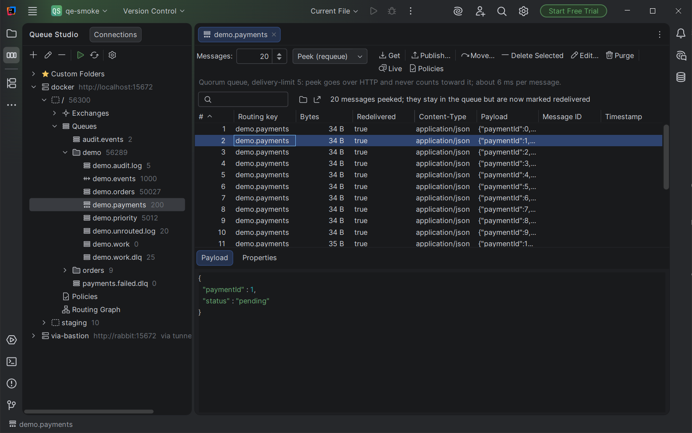
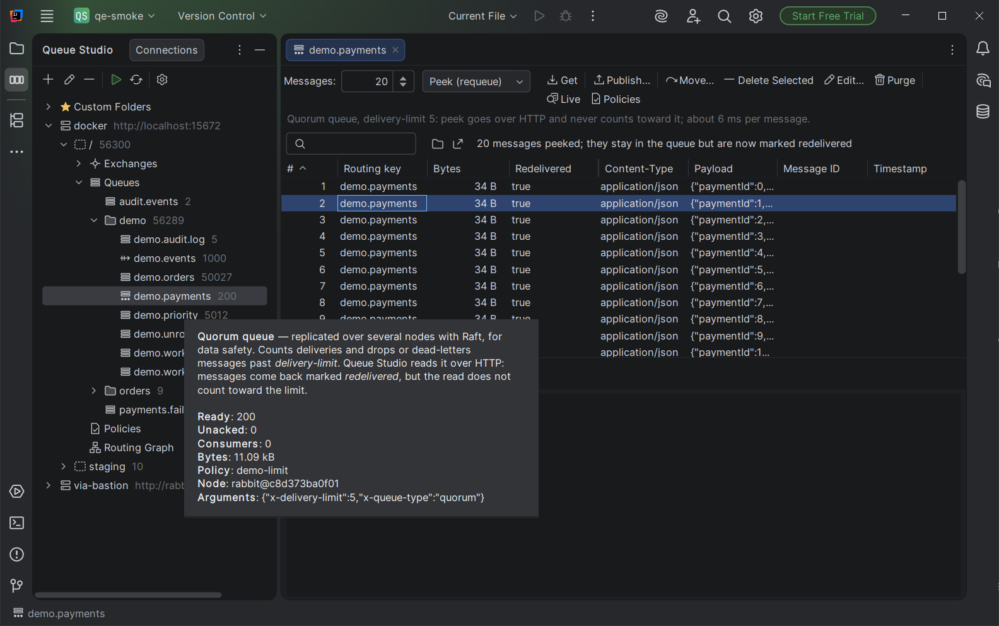
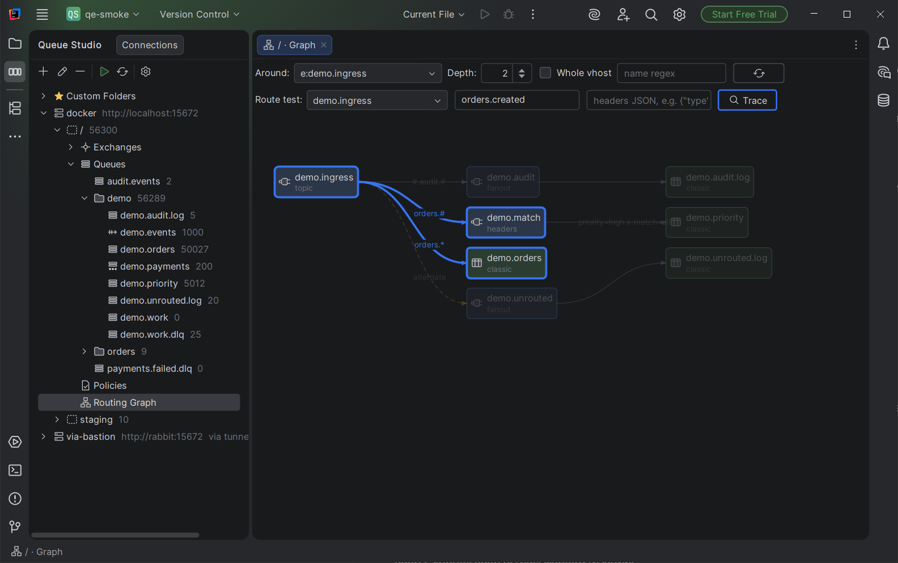
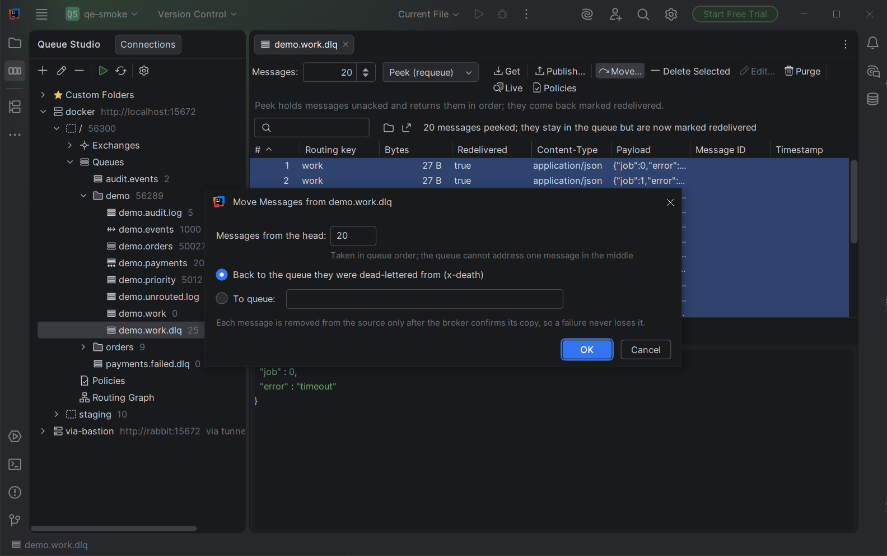
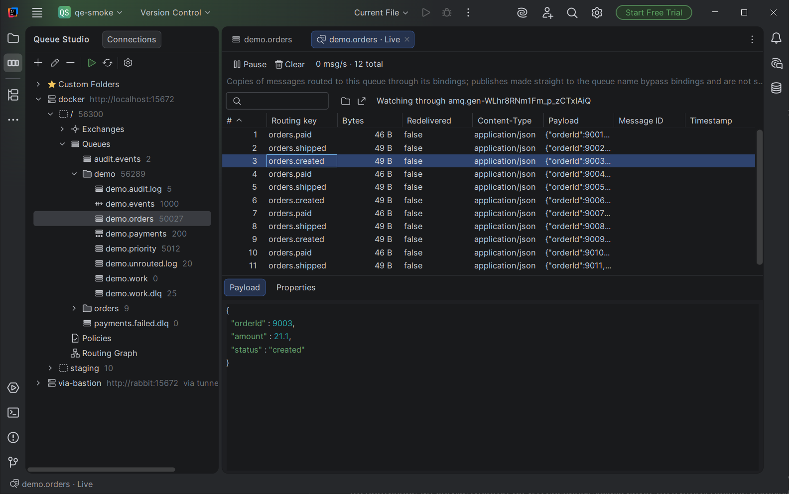

# Queue Studio for RabbitMQ

A JetBrains IDE plugin for working with RabbitMQ without leaving the editor: browse queues and exchanges, read and
publish messages, move them out of dead-letter queues without loss, delete or edit one message in the middle of a
queue, watch live traffic, read streams, manage policies and trace routing keys through a graph.

This repository holds the user guide and the issue tracker. Report a bug or ask for a feature in
[Issues](../../issues); for anything private write to factodus@gmail.com.

For Amazon SQS and SNS, see [Queue Studio for Amazon SQS](sqs/README.md).

Works in IntelliJ IDEA, PyCharm, GoLand, WebStorm and other JetBrains IDEs, version 2025.3 or newer.

| | |
|---|---|
|  |  |
|  |  |

## Getting started

1. Install **Queue Studio for RabbitMQ** from *Settings → Plugins → Marketplace*.
2. Open the **Queue Studio** tool window on the left and press **+**.
3. Enter the management URL (for example `http://localhost:15672`), user and password. The password is kept in the
   IDE password safe. Press **Test connection**.
4. Expand the connection. A click on any node opens its view in an editor tab; a double click keeps the tab open.

The plugin needs the RabbitMQ management plugin (HTTP API, port 15672 by default). Reading classic queues and streams,
moving, deleting, editing and live view also use AMQP 0-9-1 (port 5672 by default). A user with the `management` tag
is enough; the `administrator` tag is not required.

## The tree

| Node | Opens |
|---|---|
| Connection | Broker overview: version, cluster, totals, virtual hosts |
| Virtual host → Queues | Table of all queues with paging and a regex filter you can save |
| Prefix folder (`orders`, `demo`, …) | The same table filtered to that prefix |
| Queue | Messages of the queue |
| Exchanges, System Exchanges | Tables of exchanges; the built-in `amq.*` ones and the default exchange sit apart |
| Exchange | Routing graph around the exchange |
| Policies | Policies of the virtual host |
| Routing Graph | Exchanges, bindings and queues of the virtual host |
| Custom Folders | Your own groups of queues, possibly from several brokers |

Hover a node to see what kind of object it is and how it differs from others, for example classic, quorum and stream
queues. Right-click a table header to hide or show columns; the choice is remembered.

## Reading messages

| Queue type | How it is read | Side effect |
|---|---|---|
| Stream | From the start, the latest N, an offset or a point in time | None: reading a stream never changes it |
| Classic | Up to 65,535 messages held unacknowledged, then returned in their original order | Messages come back marked `redelivered` |
| Quorum | Up to 5,000 messages over the HTTP API | Marked `redelivered`; does **not** count toward `delivery-limit` |

Streams are read as soon as they open. Classic and quorum queues ask first, because consumers can see the
`redelivered` flag. Choose **Always read queues when opened** in the banner, or turn it on in *Settings → Tools →
Queue Studio*, which also sets how many messages a queue shows when opened (20 by default) and restores default table
columns. The gear on the tool window toolbar opens that page.

**Pop** removes messages from the broker and asks for confirmation. Payloads are shown as formatted JSON when they are
JSON, as text otherwise; binary and non-UTF-8 content is shown as base64 with a note.

## Changing messages

- **Publish** to a queue with properties, headers and a payload typed in or loaded from a file.
- **Move** messages from the head of the queue to another queue, or back to where a dead-lettered message came from. Each message is
  acknowledged on the source only after the broker confirms its copy on the target, so a failure never loses one.
- **Delete** selected messages from the middle of a queue. They are found by content and position; if the queue changed
  and not every target can be found, nothing is removed.
- **Edit** one message: the new version goes to the end of the queue, then the original is removed.
- **Purge** removes every ready message after a confirmation.

On quorum queues, delete and edit are refused when holding the messages would push them past `delivery-limit`.

## Live view

**Live** on a queue, an exchange (with a binding key) or a stream shows new messages as they arrive. For queues and
exchanges the plugin declares a temporary exclusive queue with the same bindings, so real consumers keep receiving
everything; the temporary queue disappears when the tab closes. Streams are followed from their end.

## Policies and routing

The **Policies** view lists, creates, edits and deletes policies. **Policies** on a queue shows which policy and operator
policy apply to it and the effective settings.

The **Routing Graph** draws exchanges, queues, bindings, exchange-to-exchange bindings, alternate exchanges and
dead-letter targets. Enter a routing key and headers to see which queues a message would reach.

## SSH bastion

For brokers in a private network, enable SSH in the connection and give the bastion host, user and one of: a key file,
the SSH agent or a password. Host keys are checked against `~/.ssh/known_hosts`; an unknown key is shown for you to
trust. The broker host name is resolved on the bastion side.

## Privacy

The plugin collects no data. It connects only to the brokers and SSH hosts you configure. Passwords are stored in the
IDE password safe.

## Licensing

Queue Studio is a paid plugin sold through JetBrains Marketplace, with a 30-day free trial, under the [end user license agreement](EULA.md).

RabbitMQ is a trademark of Broadcom, Inc. Queue Studio is an independent tool and is not affiliated with Broadcom.
