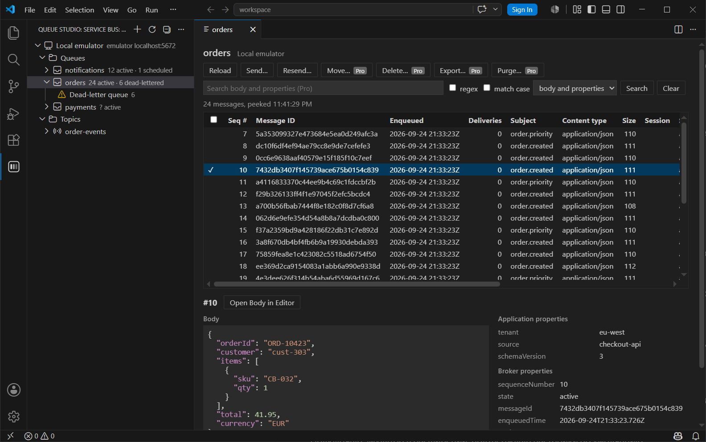
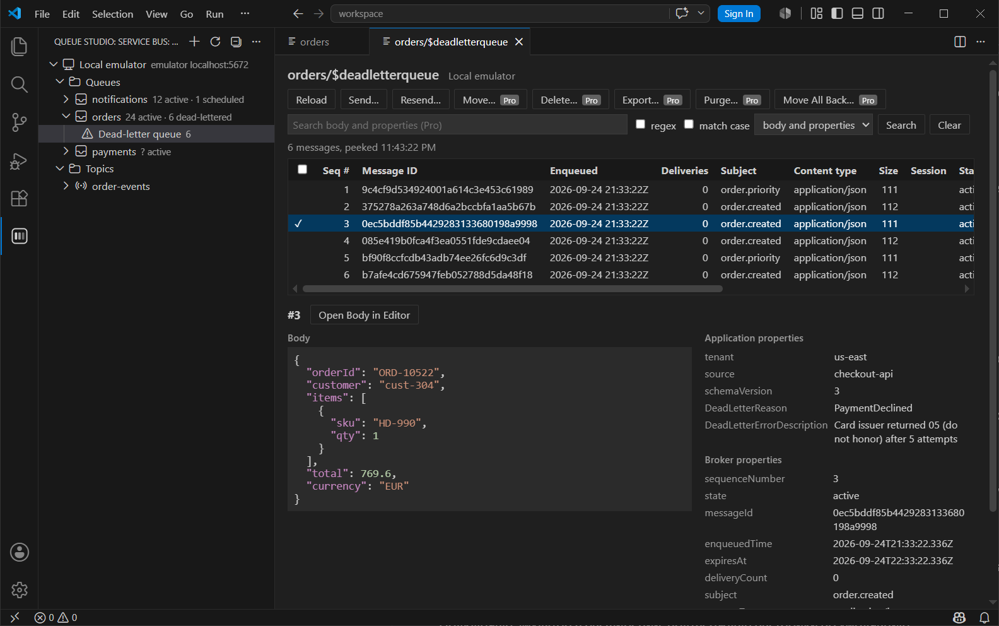
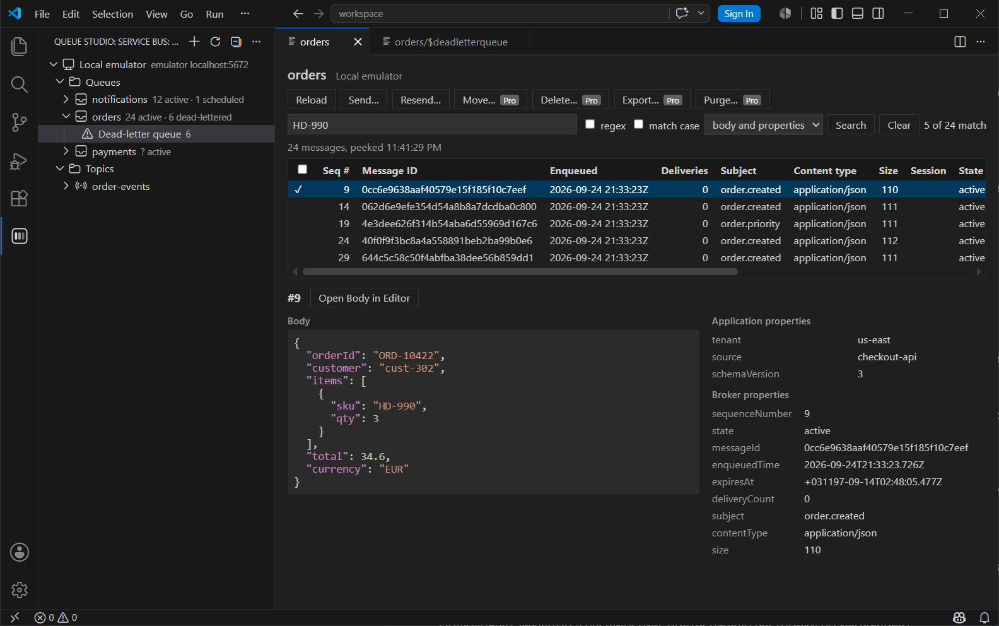
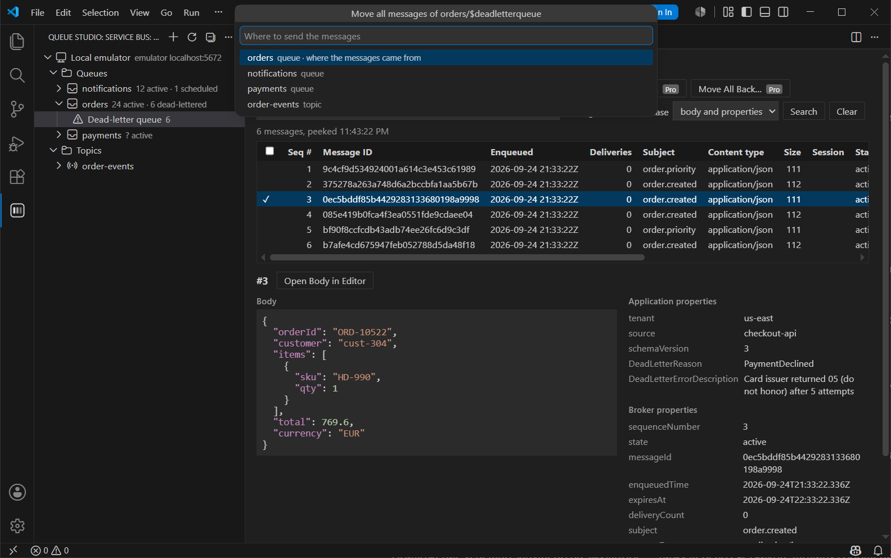

# Queue Studio for Service Bus

A Visual Studio Code extension for Service Bus queues, topics and dead-letter queues. Cloud namespaces and the
local emulator sit in one tree. You can peek a whole queue without locking anything, search message bodies and
properties, and move a whole dead-letter queue back in one operation. It works with Azure Service Bus and the
Service Bus emulator.

Website and pricing: <https://drbenzin.github.io/queue-studio-docs/servicebus/>. Report a bug or ask for a feature
in [Issues](https://github.com/drbenzin/queue-studio-docs/issues); for anything private, write to
factodus@gmail.com.

## Installation

The extension ID is `factodus.queue-studio-service-bus`. It needs VS Code 1.96 or newer.

- **VS Code Marketplace:** search for *Queue Studio for Service Bus* in the Extensions view, or open
  [its page](https://marketplace.visualstudio.com/items?itemName=factodus.queue-studio-service-bus).
- **Open VSX**, for VSCodium and other editors that use it:
  [open-vsx.org/extension/factodus/queue-studio-service-bus](https://open-vsx.org/extension/factodus/queue-studio-service-bus).
- **Command line:** `code --install-extension factodus.queue-studio-service-bus`.

## Connections

Open **Queue Studio: Service Bus** in the activity bar and press **+**. There are three ways to connect:

- **Connection string.** Use a namespace-level string from *Shared access policies*. An entity-level string with
  `EntityPath` cannot list the namespace. The string is kept in VS Code's secret storage.
- **Microsoft Entra ID.** Enter the fully qualified namespace, for example `contoso.servicebus.windows.net`, and pick
  a credential: *Default Azure credential* (environment, managed identity, Azure CLI, Azure PowerShell, azd) or
  *Azure CLI* (the account of `az login`). A tenant id is optional. Roles needed:
  - reading: *Azure Service Bus Data Receiver*;
  - sending: *Azure Service Bus Data Sender*;
  - creating, editing and deleting entities: *Azure Service Bus Data Owner*.
- **Local emulator.** Enter the host, the AMQP port (5672) and the management port (5300, `EMULATOR_HTTP_PORT` of
  the emulator container).

The connection is tried before it is saved. *Remove Connection* in the context menu forgets it and its secret.

## The tree

| Node | Shows |
|---|---|
| Connection | The Queues and Topics folders of the namespace |
| Queue | Active, dead-letter and scheduled counts; its dead-letter queue below it |
| Topic | Scheduled count; its subscriptions below it |
| Subscription | Active and dead-letter counts; its dead-letter queue below it |
| Dead-letter queue | The dead-lettered messages of its queue or subscription |

Click a queue, subscription or dead-letter queue to peek it. The refresh button re-reads a connection, a folder or a
topic.

The context menu creates queues, topics and subscriptions, deletes them, and opens **Settings…**: max delivery
count, lock duration, time to live, dead-lettering on expiration and forwarding.

## Peek without locks

Peek walks the whole queue, subscription, dead-letter queue or one session by sequence number, in pages, up to a
limit you set. Nothing is locked, so delivery counts and consumers are not affected.

The table shows sequence number, message id, enqueue time, delivery count, subject, content type, size, session,
state and application properties. The detail pane shows the body, formatted and coloured when it is JSON, and every
property.

A dead-letter queue shows the reason and description Service Bus recorded for each message:

Session-enabled queues and subscriptions are peeked one session at a time with **Peek Session…**. Accepting a
session locks it, so its consumer waits until the peek is done. Their dead-letter queues need no session.

## Sending

**Send Message…** on a queue or topic takes a body, content type, subject, message id, correlation id, application
properties, session id, time to live and scheduled enqueue time. **Resend** fills the same form from a selected
message.

## Pro

| | Free | Pro |
|---|---|---|
| Connections: connection string, Entra ID, emulator | ✓ | ✓ |
| Tree with counts, dead-letter queues | ✓ | ✓ |
| Peek without locks, sessions | ✓ | ✓ |
| Send and resend | ✓ | ✓ |
| Create, edit and delete entities | ✓ | ✓ |
| Search in bodies and properties | | ✓ |
| Move a whole dead-letter queue | | ✓ |
| Move or delete selected messages | | ✓ |
| Purge | | ✓ |
| Export to JSON or NDJSON, send messages from a file | | ✓ |

- **Search** the peeked messages by substring or regular expression, in bodies, application properties
  (`name=value`) or both.

  

- **Move a whole dead-letter queue** back to its queue, or to its topic for a subscription, or to any queue or
  topic. Each batch is sent first and removed from the dead-letter queue only after the send succeeded, so a
  failure leaves the messages where they were. Progress is shown and the move can be cancelled.

  

- **Move or delete selected messages.** Service Bus cannot remove a message from the middle of a queue by id. To
  reach the selected ones, messages are received from the start with a lock and the others are released. On a main
  queue each released message counts one more delivery; the confirmation says so. Selected scheduled messages are
  cancelled.
- **Purge** a queue, a subscription, a dead-letter queue or one session.
- **Export** selected or shown messages to JSON or NDJSON, and **Send Messages from File…** sends such a file to a
  queue or topic.

### Trial

Every Pro feature works for 14 days from the first run, without an account or payment details. When the trial ends
nothing is charged: the Pro features ask for a license key, and the free features keep working.

### Prices

| | Monthly | Yearly |
|---|---|---|
| Personal, paid by an individual | $4 | $40 |
| Organization, paid by a company | $8 | $80 |

Prices are per person and in US dollars. Polar, the merchant of record, sells the license keys, calculates any sales
tax or VAT at checkout and handles invoices, renewals, cancellations and refunds. See the
[terms of sale](TERMS.md).

### Activating a license key

1. Buy Pro with the **Buy Pro** command or on the [website](https://drbenzin.github.io/queue-studio-docs/servicebus/#pricing).
   Polar shows the license key after checkout and sends it by email.
2. Run **Queue Studio: Enter License Key…** from the Command Palette, or use the menu of the Connections view, and
   paste the key. It is checked with Polar and kept in VS Code's secret storage.
3. **Queue Studio: License Status** shows the state: the trial days left, the key and its expiry, or why Pro is
   not available. The state is also shown next to the view title.

While a key is active the extension re-checks it with Polar about every three days. If Polar cannot be reached, Pro
keeps working offline for seven more days.

To move a key to another machine, run **Remove License Key from This Machine**, or remove the machine in the
[customer portal](https://polar.sh/factodus/portal), where you can also cancel the subscription and download
invoices.

## Settings

| Setting | Default | |
|---|---|---|
| `queueStudioServiceBus.peek.limit` | 1000 | Messages one peek walk reads at most |
| `queueStudioServiceBus.peek.pageSize` | 100 | Messages per peek request |
| `queueStudioServiceBus.operations.batchSize` | 50 | Messages a move, delete or purge takes at a time |

## Limitations

- An entity-level connection string with `EntityPath` cannot list the namespace; use a namespace-level one.
- Session-enabled entities are peeked one session at a time, and the peek holds that session's lock while it runs.
- Moving or deleting selected messages receives the messages before them with a lock and releases them, which
  raises their delivery count on a main queue.

With the local emulator (tested with `mcr.microsoft.com/azure-messaging/servicebus-emulator` 2.0):

- The management API is plain HTTP on port 5300, while the JavaScript administration client only speaks HTTPS, so
  Queue Studio switches the scheme for emulator connections.
- Queue descriptions carry no count details and subscription counts are always zero. For the emulator, counts come
  from a peek walk; the active count of a session-enabled queue or subscription is shown as `?`.
- Updating an entity succeeds, but the SDK cannot parse the answer. Queue Studio reads the settings back and reports
  any value that did not take effect.
- A plain receiver on a session-enabled entity peeks nothing instead of failing, which is why Queue Studio asks for
  a session.
- Limits of the emulator itself: one namespace, 50 entities, 256 KB messages, time to live of at most one hour, no
  Entra ID, nothing persists across a container restart.

## Privacy

The extension collects no telemetry. It talks to the Service Bus namespaces and emulators you configure, and sends
the license key and the machine identifier to Polar to check a license. See the [privacy policy](PRIVACY.md).

## License and support

Queue Studio for Service Bus is proprietary, under the [end user license agreement](EULA.md). Purchases follow the
[terms of sale](TERMS.md). For help, see [support](SUPPORT.md).

Microsoft, Azure, Azure Service Bus and Visual Studio Code are trademarks of the Microsoft group of companies. Queue
Studio is an independent product and is not affiliated with or endorsed by Microsoft.
