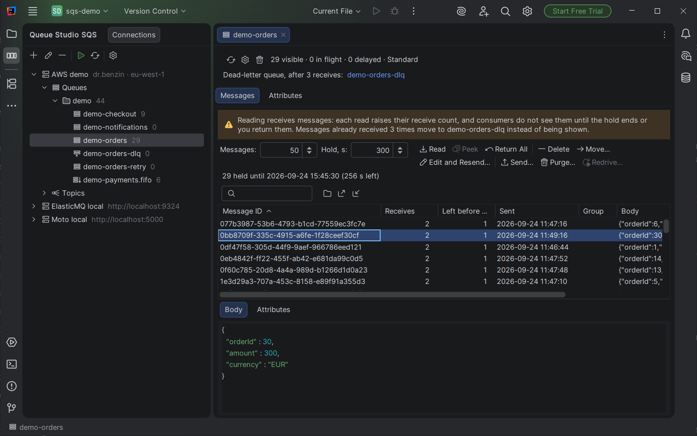
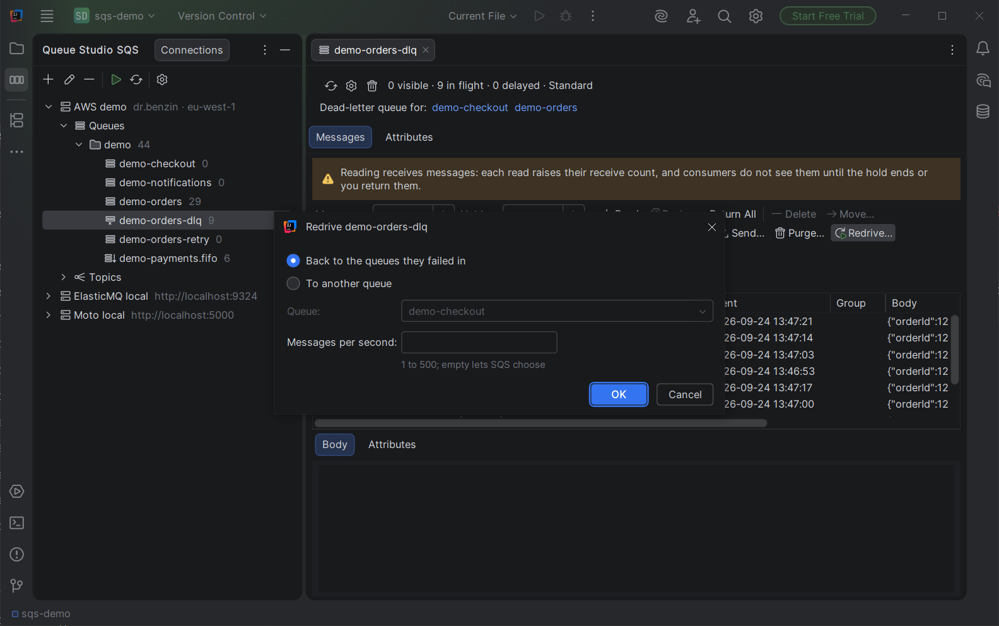
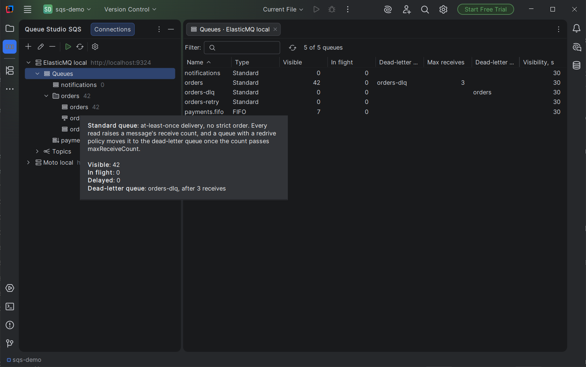
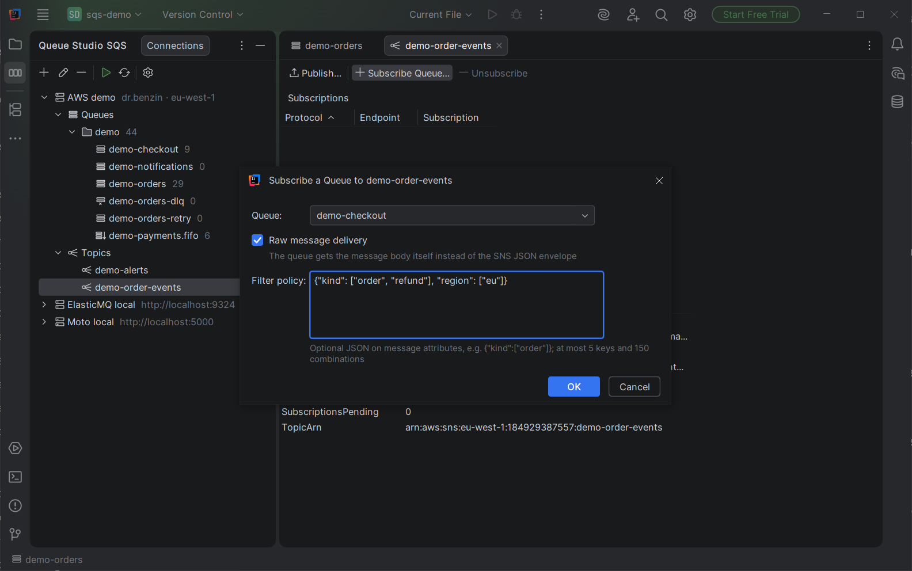
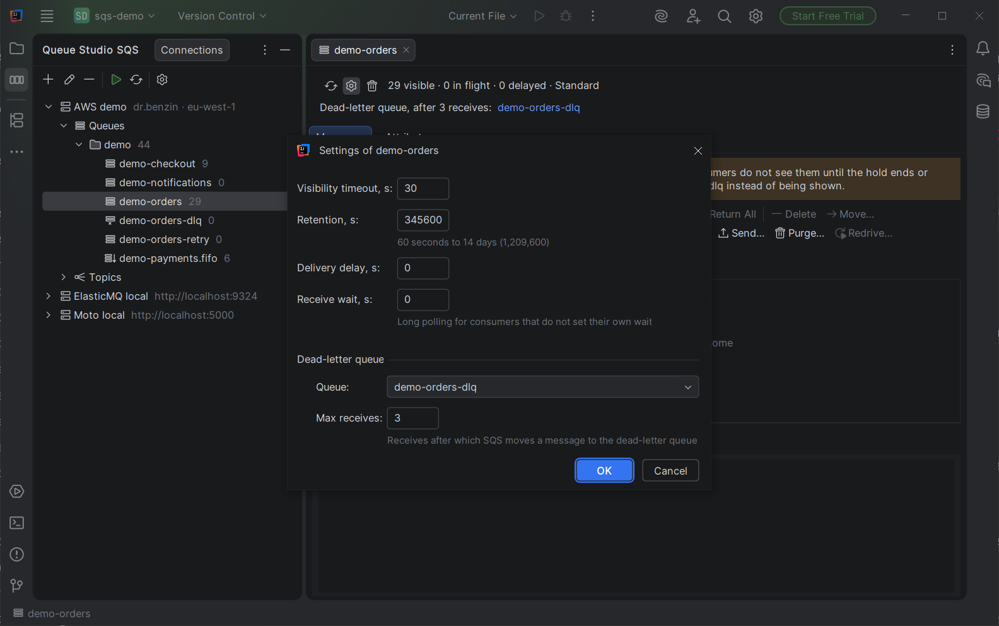

# Queue Studio for Amazon SQS

A JetBrains IDE plugin for Amazon SQS and SNS. It connects to AWS profiles and to local emulators, reads up to 10,000
messages at once with receive counts, redrives dead-letter queues, and publishes to topics, all without leaving the
editor.

Report a bug or ask for a feature in [Issues](../../../issues). For anything private, write to factodus@gmail.com.

It works in IntelliJ IDEA, PyCharm, GoLand, WebStorm and other JetBrains IDEs, version 2025.3 or newer.

| | |
|---|---|
|  |  |
|  |  |

## Getting started

1. Install **Queue Studio for Amazon SQS** from *Settings → Plugins → Marketplace*.
2. Open the **Queue Studio SQS** tool window on the left and press **+**.
3. Choose how to connect:
   - **AWS profile**: pick a profile from `~/.aws/config` or `~/.aws/credentials`, and a region.
     - SSO profiles work after `aws sso login`.
     - Assume-role profiles work as they are.
     - Profiles with `mfa_serial` ask for the MFA code once per session.
   - **Local emulator**: enter its endpoint, for example `http://localhost:4566` for LocalStack, `http://localhost:9324` for
     ElasticMQ or `http://localhost:5000` for Moto. Any credentials are accepted there.
4. Press **Test**. For a profile, the plugin shows which identity it acts as; for an emulator, how many queues it sees.
5. Expand the connection. A click on any node opens its view in an editor tab, and a double click keeps the tab open.

The plugin needs these permissions:
- **To read:** `sqs:ListQueues`, `sqs:GetQueueAttributes`, `sqs:ReceiveMessage`, `sqs:ListDeadLetterSourceQueues`, `sns:ListTopics`, `sns:GetTopicAttributes` and `sns:ListSubscriptionsByTopic`.
- **For the actions of the same name:** `sqs:SendMessage`, `sqs:DeleteMessage`, `sqs:ChangeMessageVisibility`, `sqs:PurgeQueue`, `sqs:StartMessageMoveTask`, `sqs:CreateQueue`, `sqs:SetQueueAttributes`, `sqs:DeleteQueue`, `sns:Publish` and `sns:Subscribe`.

## The tree

| Node | Opens |
|---|---|
| Connection, Queues | Table of all queues: visible, in flight, delayed, dead-letter queue, max receives, which queues dead-letter into it |
| Prefix folder (`orders`, …) | The same table filtered to that prefix |
| Queue | Counts, redrive links in both directions, messages and all attributes |
| Topics | Table of topics |
| Topic | Subscriptions and attributes, with publish and subscribe |

The icon marks FIFO queues and queues that other queues dead-letter into. The tooltips explain queue and topic types
and show each queue's counts.

Right-click **Queues** to create a queue or re-read the list; the toolbar's refresh re-reads the whole connection.

## Reading messages

SQS has no way to look at a message without receiving it. **Read** receives up to the number you set and holds the messages
invisible to consumers for the hold time. That way each one is read once, and you can return it or delete it afterwards.

The yellow banner says what a read does to this queue:
- every read raises a message's receive count;
- in a queue with a redrive policy, a message already received `maxReceiveCount` times moves to the dead-letter queue
  instead of being shown;
- in a FIFO queue, a held message blocks the rest of its message group.

The table shows:
- **Receives** — the receive count, including this read;
- **Left before DLQ** — receives left before SQS moves the message; 0 means the next read moves it;
- the time the message was sent, and the group and deduplication ids.

The status shows how long the hold lasts. **Return All** makes the held messages visible again at once, and closing
the tab does the same. When the hold runs out, the messages are visible to consumers again and can no longer be
deleted from here.

On **LocalStack**, **Peek** lists the messages without receiving them. Receive counts, visibility and redrive stay as
they were. Real SQS offers nothing like it.

The search box filters by message id, body and message attributes. **Open in Editor** shows the body as a JSON file.
**Export** writes what the table shows to a JSON file. **Send Messages from File** sends such a file to a queue.

## Changing messages and queues

| Action | What it does |
|---|---|
| Send | A message with String message attributes; FIFO queues ask for group and deduplication ids, standard ones take a delay |
| Delete | Deletes the selected held messages |
| Move | Copies the selected held messages to another queue and deletes each original only after its copy is accepted. A FIFO target gets the source queue as group and the message id as deduplication id |
| Edit and Resend | Opens one held message for editing, sends it to a queue (by default the one it dead-lettered from), then deletes the original |
| Purge | Deletes every message of the queue; SQS allows one purge per queue every 60 seconds |
| Redrive | On a dead-letter queue: returns anything held, then moves all messages back to the queues they failed in, or to a chosen queue, with an SQS move task. The progress can be cancelled, which cancels the task |
| Queue Settings | Visibility timeout, retention, delay, receive wait, content deduplication, dead-letter queue and max receives |
| Delete Queue | Deletes the queue and its messages |

Move and Edit and Resend send first and delete after. If the hold ends between the two steps, a consumer may see both
copies. Nothing is lost either way.

## SNS

A topic's tab lists its subscriptions and attributes. Double-click an SQS subscription to open its queue.

- **Publish** sends a message with a subject, String attributes and, for FIFO topics, group and deduplication ids.
- **Subscribe Queue** subscribes a queue of the same connection. It also adds the queue policy statement that SNS needs
  to deliver, which the API does not do on its own. Other statements stay as they are.
  - **Raw message delivery** is on by default.
  - A filter policy is checked against the SNS limits before it is sent: at most 5 keys and 150 combinations.
- **Unsubscribe** removes the selected subscription.

## Settings

*Settings → Tools → Queue Studio for Amazon SQS* holds:
- the default number of messages to read and the default hold;
- a button that restores the default table columns;
- the plugin version, the license state and links to this guide and to Issues.

Right-click a table header to show or hide its columns.

## Privacy

The plugin collects no data. It talks only to the AWS endpoints and emulators you configure, with the credentials of
your own profiles.

## License

A paid plugin with a 30-day free trial, sold through JetBrains Marketplace. See the [end user license agreement](EULA.md).

Amazon SQS, Amazon SNS and AWS are trademarks of Amazon.com, Inc. or its affiliates. This plugin is an independent
tool and is not affiliated with or endorsed by Amazon.
